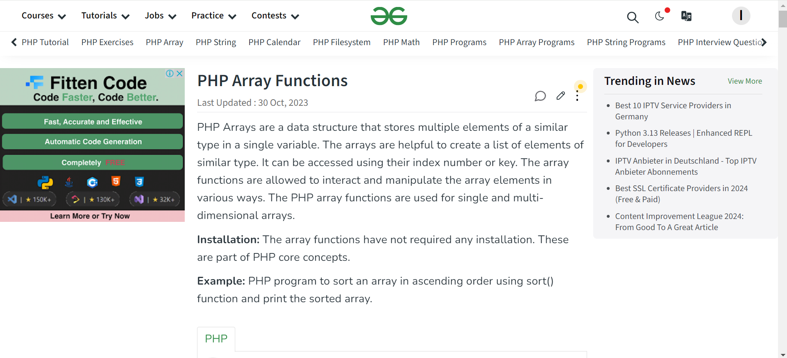
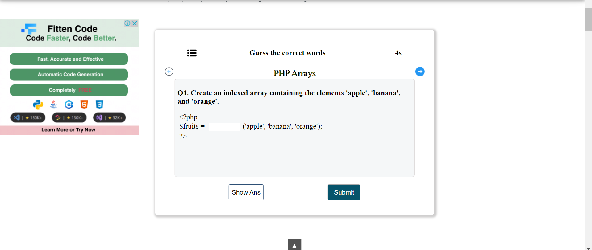
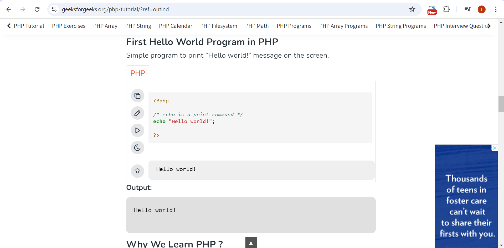

### Tugas 1
Nama: Iif Alifah 
Nim: 2110131220013

Review GeeksforGeeks sebagai <i>Tutor</i>, <i>Tools</i>, dan <i>Tutee</i> 
---

GeeksforGeeks merupakan platform yang menyediakan berbagai materi untuk belajar ilmu komputer dan pengembangan keterampilan teknis. Platform ini menawarkan tutorial, soal latihan dan kursus di berbagai bidang komputer. Didirikan pada tahun 2008 oleh Sandeep Jain, GeeksforGeeks bertujuan untuk mendukung pembelajaran dan pengembangan keterampilan di bidang ilmu komputer.

As Tutor:
---

Komputer sebagai tutor berarti komputer digunakan untuk memberikan instruksi atau pembelajaran kepada siswa. Di GeeksforGeeks, berbagai tutorial disusun secara sistematis dan terstruktur untuk membantu pengguna belajar secara mandiri, seolah-olah komputer berperan sebagai pengajar. Platform ini menawarkan berbagai materi pembelajaran, salah satunya tutorial pemrograman dalam bahasa seperti Python, Java, PHP, dan lainnya. Selain menyajikan materi, GeeksforGeeks juga menyediakan latihan soal untuk membantu pengguna menguji dan memperdalam pemahaman mereka. Dengan mengikuti langkah-langkah yang disediakanl dan mengerjakan latihan soal, pengguna dapat memahami dan menguasai berbagai konsep teknis dengan lebih efektif.  
Tampilan halaman materi pada GeeksforGeeks:

Tampilan halaman latihan pada GeeksforGeeks:

 

As Tools:
---

GeeksforGeeks menyediakan compiler online yang memungkinkan pengguna untuk menulis, mengedit, dan menjalankan kode secara langsung di browser mereka. Dalam konteks ini, komputer berfungsi sebagai alat yang sangat berguna bagi pengguna dalam proses pengkodean. Compiler online ini mempermudah pengguna untuk mengembangkan dan menguji kode mereka tanpa perlu menginstall perangkat lunak tambahan. Dengan alat ini, pengguna dapat dengan mudah menulis dan memperbaiki kode, serta melihat hasilnya secara real-time, yang meningkatkan efisiensi dan efektivitas dalam proses belajar dan pengembangan keterampilan pemrograman.

As Tutee:
---

Di GeeksforGeeks, pengguna menulis kode untuk memberi perintah kepada komputer agar menyelesaikan tugas tertentu. Di sini, komputer bertindak sebagai tutee yang menerima dan mengikuti instruksi dari pengguna. Dengan cara ini, pengguna mengajarkan komputer cara menjalankan berbagai tugas menggunakan bahasa pemrograman yang dipelajari.

